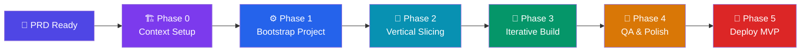
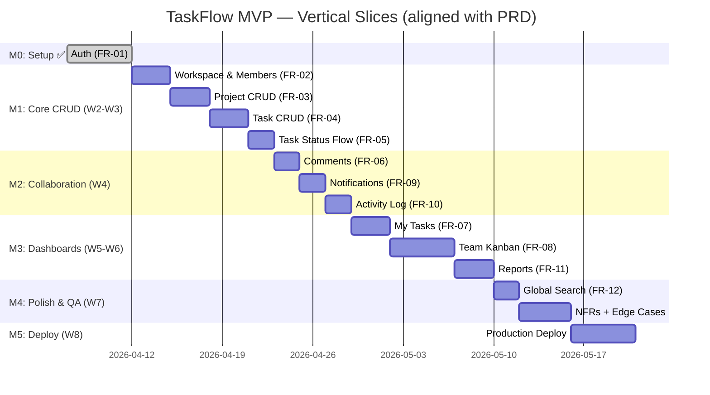
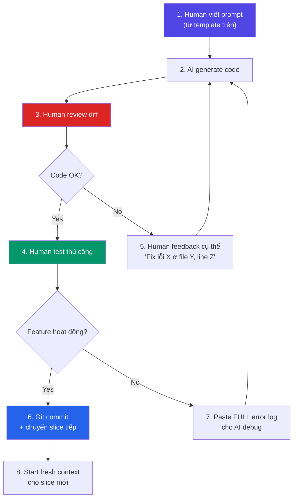
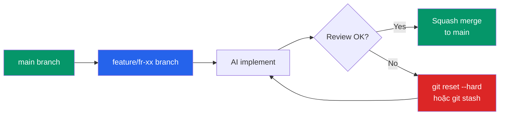

# 🚀 Vibe Coding Step-by-Step: Từ PRD TaskFlow → Sản phẩm hoạt động

> **Bối cảnh:** Bạn đã có PRD TaskFlow chi tiết. Tài liệu này hướng dẫn quy trình vibe coding hiệu quả & an toàn — bao gồm **AI làm gì**, **Human làm gì**, và **thứ tự thực hiện**.
> **Người viết:** Quan Nguyen - Project Manager
> **Ngày:** 07/04/2026
---

## 📐 Tổng quan quy trình



---

## 🧑‍💻 Vai trò Human vs AI trong Vibe Coding

> [!IMPORTANT]
> Vibe coding **KHÔNG** phải "để AI code hết". Human chuyển vai trò từ "người viết code" sang **"kiến trúc sư + người kiểm duyệt chất lượng"**.

| Trách nhiệm | 🧑 Human | 🤖 AI |
|---|:---:|:---:|
| Định nghĩa "cái gì cần làm" (intent) | ✅ Chính | Hỗ trợ |
| Quyết định kiến trúc tổng thể | ✅ Chính | Đề xuất |
| Viết code implementation | Hỗ trợ | ✅ Chính |
| Review & phê duyệt code | ✅ Chính | — |
| Viết test cases | Cùng làm | ✅ Chính |
| Fix bug phức tạp | Cùng làm | ✅ Chính |
| Quyết định trade-off kỹ thuật | ✅ Chính | Tư vấn |
| Đảm bảo security | ✅ Chính | Hỗ trợ |
| Git workflow (commit, PR) | ✅ Chính | Hỗ trợ |

---

## Phase 0: Context Setup (Human làm — ~30 phút)

> **Mục tiêu:** Tạo "bộ não dài hạn" cho AI — để nó hiểu dự án xuyên suốt mọi phiên làm việc.

### Human cần làm:

#### ✅ 1. Đặt PRD vào project root

```
taskflow/
├── docs/
│   └── PRD.md          ← Copy PRD_TaskFlow.md vào đây
├── AGENTS.md           ← File hướng dẫn cho AI agent
└── ...
```

#### ✅ 2. Tạo file `AGENTS.md` (Project Rules)

Đây là file quan trọng nhất — nó dạy AI "phong cách code" của dự án. Human tự viết hoặc nhờ AI draft rồi review:

```markdown
# TaskFlow — Agent Instructions

## Tech Stack (KHÔNG ĐƯỢC thay đổi trừ khi có justification từ Tech Lead)
### Frontend
- Framework: Next.js 16 (App Router) + TypeScript
- UI Components: shadcn/ui + Tailwind CSS
- State Management: Zustand (client state) + TanStack Query (server state)
- Drag & Drop: @dnd-kit/core (Kanban board)
- Form: React Hook Form + Zod validation

### Backend
- Runtime: Node.js + Express
- ORM: Prisma
- Database: PostgreSQL ≥ 14
- Authentication: JWT (7 ngày expiry) + bcrypt (cost factor ≥ 12)
- Email: Resend (free tier)

### DevOps
- Hosting: Railway (backend + DB), Vercel (frontend)
- CI/CD: GitHub Actions
- Monitoring: Sentry

## Coding Conventions
- TypeScript strict mode bắt buộc
- Component naming: PascalCase (e.g., TaskCard.tsx)
- API routes: kebab-case (e.g., /api/tasks/update-status)
- API response format chuẩn: { success: boolean, data?: T, error?: string }
- Luôn có error handling cho mọi API call
- Mọi form dùng React Hook Form + Zod validation
- UI text bằng tiếng Việt
- Loading state hiển thị khi API call > 300ms
- Empty states phải có hướng dẫn hành động (không để trang trắng)

## Architecture Patterns
- Feature-based folder structure
- Server Components by default, 'use client' chỉ khi cần interactivity
- Soft delete cho tasks (deleted_at timestamp)
- Optimistic UI cho status changes, rollback nếu API lỗi
- Toast notifications: auto-dismiss sau 4 giây
- Slide-over panel cho task detail (không navigate ra trang mới)

## Security Rules (KHÔNG BAO GIỜ vi phạm)
- KHÔNG hardcode secrets — dùng env variables
- Input sanitization cho mọi user input (ngăn XSS, SQL injection)
- Rate limiting: 100 requests/phút per IP
- Row-level isolation: data workspace A không lộ sang workspace B
- Password KHÔNG BAO GIỜ xuất hiện trong API response

## Testing
- Viết test cho mọi API endpoint (unit test)
- Component test cho interactive components (form, drag-drop)
- Edge case test theo PRD section 10
```

> [!TIP]
> **Về version Next.js:** PRD ghi Next.js 16 — hãy đảm bảo AGENTS.md và prompt đều thống nhất version này. Mismatch version là lỗi phổ biến nhất gây conflict giữa các phiên làm việc.

#### ✅ 3. Tạo file Implementation Plan

Nhờ AI tạo, nhưng **Human phải review và approve**:

```
Prompt cho AI:
"Đọc file docs/PRD.md và tạo file docs/implementation-plan.md. 
Chia thành 6 milestones theo PRD section 14 (M0→M5). 
Mỗi milestone liệt kê:
- Các FR cụ thể cần implement (tham chiếu FR-XX)
- Các file/module sẽ tạo
- Dependencies với milestone trước
- Acceptance gate (copy từ PRD)
Sắp xếp theo thứ tự triển khai."
```

> [!TIP]
> **Pro tip:** Luôn yêu cầu AI tạo plan TRƯỚC khi code. Review plan tốn 5 phút nhưng tiết kiệm hàng giờ sửa code sai hướng.

---

## Phase 1: Bootstrap Project (AI làm, Human giám sát — ~1-2 giờ)

> **Mục tiêu:** Repo chạy được locally, database schema ready, auth hoạt động.

### Step 1.1: Khởi tạo project

```
Prompt: "Khởi tạo Next.js 16 project với App Router + TypeScript. 
Cài đặt dependencies theo AGENTS.md (bao gồm shadcn/ui, Tailwind, 
Zustand, TanStack Query, @dnd-kit/core, React Hook Form, Zod, 
Prisma, Express, bcrypt, jsonwebtoken). 
Setup Prisma với PostgreSQL.
Tạo cấu trúc folder theo feature-based architecture."
```

**🧑 Human kiểm tra:**
- [ ] `npm run dev` chạy không lỗi
- [ ] Cấu trúc folder hợp lý (feature-based, không dump hết vào `components/`)
- [ ] Dependencies đúng version (đặc biệt Next.js phải là 16)
- [ ] `.env.example` đã tạo với placeholder values

### Step 1.2: Database Schema

```
Prompt: "Đọc database schema trong docs/PRD.md section 13.
Tạo Prisma schema với đầy đủ models: users, workspaces, 
workspace_members, projects, tasks, comments, activity_logs, 
notifications, invite_tokens. 
Thêm proper relations, indexes cho foreign keys và search fields, 
và enum types cho status/priority/role.
Soft delete field (deleted_at) cho tasks.
Activity log KHÔNG cho phép xóa (không có delete endpoint)."
```

**🧑 Human kiểm tra:**
- [ ] Schema match PRD (so sánh từng table — đặc biệt đủ 9 tables)
- [ ] Relations đúng (1-n, n-n)
- [ ] Có indexes cho foreign keys và search fields
- [ ] Enum types match PRD (status: ToDo/InProgress/InReview/Done, priority: Low/Medium/High/Urgent, role: Admin/Manager/Member)
- [ ] `deleted_at` nullable trên tasks

### Step 1.3: Authentication (FR-01)

```
Prompt: "Implement authentication theo FR-01 trong PRD:
- API: POST /api/auth/register, POST /api/auth/login, POST /api/auth/logout
- JWT với 7 ngày expiry
- bcrypt cost factor ≥ 12
- UI: Trang /login và /register với form validation (Zod)
- Middleware kiểm tra auth cho /app/* routes
- Edge case xử lý (xem PRD section 10.2):
  + Duplicate email → lỗi 'Email này đã được đăng ký. Bạn có muốn đăng nhập không?'
  + Wrong password 5 lần → khóa tạm 15 phút + countdown timer
  + Token expired → intercept 401, redirect /login với message 'Phiên làm việc đã hết hạn.'
  + Mở 2 tab, logout 1 tab → tab kia tự detect via storage event → redirect login
- QUAN TRỌNG: Password KHÔNG BAO GIỜ xuất hiện trong API response"
```

**🧑 Human kiểm tra:**
- [ ] Đăng ký → đăng nhập hoạt động
- [ ] Token 401 redirect đúng
- [ ] Password được hash (check DB — không có plaintext)
- [ ] API response không chứa password/hash
- [ ] Test: đăng ký email trùng → thông báo đúng
- [ ] Test: sai password 5 lần → lock 15 phút

> [!WARNING]
> **Checkpoint quan trọng:** Commit lên Git trước khi tiếp tục. `git commit -m "feat: project setup + auth (FR-01)"`

---

## Phase 2: Vertical Slicing (Human thiết kế, AI implement)

> **Nguyên tắc vàng:** Mỗi lần chỉ prompt **1 feature end-to-end** (UI → API → DB). KHÔNG BAO GIỜ prompt "build cả app".

### Thứ tự recommend (align chính xác với PRD Section 14):



> [!IMPORTANT]
> **Milestone mapping (PRD section 14):**
> - **M0** (W1): Setup + Auth (FR-01) — Gate: dev env chạy locally
> - **M1** (W2-W3): FR-02, FR-03, FR-04, FR-05 — Gate: tạo/assign/đổi status task hoạt động
> - **M2** (W4): FR-06, FR-09, FR-10 — Gate: comment, notification, activity log
> - **M3** (W5-W6): FR-07, FR-08, FR-11 — Gate: My Tasks, Kanban board, Reports
> - **M4** (W7): FR-12 + all NFRs + edge cases — Gate: QA pass, performance SLA đạt
> - **M5** (W8): Production deploy — Gate: Stakeholder sign-off

### Template prompt cho mỗi slice:

```markdown
## Context
Đọc file docs/PRD.md, focus vào section [FR-XX] và edge cases liên quan (section 10).
Đọc AGENTS.md để follow coding conventions.

## Task
Implement [Tên feature] bao gồm:

### Backend
- API endpoints: [liệt kê cụ thể với HTTP method + path]
- Validation: [input rules từ PRD — max length, required fields, v.v.]
- Error handling: [edge cases từ PRD section 10]
- Authorization: [role nào được access — Admin/Manager/Member]

### Frontend  
- UI component: [mô tả layout, vị trí trong navigation structure từ PRD section 12.2]
- Form validation: Zod schema theo PRD constraints
- UX patterns: [optimistic UI? toast? slide-over? empty state?]

### Tests
- Unit test cho API endpoint (happy path + error cases)
- Kiểm tra edge cases: [liệt kê cụ thể từ PRD section 10]

## Acceptance Criteria
[Copy NGUYÊN VĂN từ PRD User Stories section 9 — KHÔNG tự viết lại]

## Constraints
- KHÔNG modify code/schema của features đã implement trước đó
- Follow patterns trong AGENTS.md
- API response format: { success: boolean, data?: T, error?: string }
```

### 📝 Ví dụ cụ thể: Prompt cho FR-04 (Task CRUD)

Đây là ví dụ hoàn chỉnh để bạn thấy template hoạt động thế nào:

```markdown
## Context
Đọc file docs/PRD.md, focus vào FR-04 (Tạo và chỉnh sửa Task) 
và edge cases section 10.1 (Task Management).
Đọc AGENTS.md để follow coding conventions.

## Task
Implement Task CRUD bao gồm:

### Backend
- POST /api/tasks — Tạo task mới
- GET /api/tasks/:id — Xem chi tiết task
- PATCH /api/tasks/:id — Chỉnh sửa task
- DELETE /api/tasks/:id — Soft delete task (set deleted_at)
- GET /api/projects/:projectId/tasks — List tasks trong project

Validation:
- title: required, max 200 ký tự
- description: optional, max 5000 ký tự, markdown supported
- assignee_id: optional, phải là member của workspace
- project_id: required, phải thuộc workspace hiện tại
- priority: enum Low/Medium/High/Urgent
- due_date: optional, cho phép ngày quá khứ (nhưng hiển thị Overdue badge)
- status: mặc định "To Do" khi tạo

Authorization:
- Manager và Member đều có thể tạo task
- Chỉ creator, assignee, hoặc Manager mới được edit
- Soft delete chỉ Manager

Edge cases (PRD 10.1):
- Task title có <script> → sanitize, lưu plain text
- Assignee bị xóa khỏi workspace → hiển thị "[Removed User]"
- 2 user edit cùng lúc → last-write-wins, activity log ghi từng lần

### Frontend
- Nút "+ New Task" accessible từ mọi trang (PRD NFR-05: max 3 click)
- Form tạo task: slide-over panel từ phải (PRD section 12.3)
- Zod schema validate các constraints ở trên
- Optimistic UI khi create → rollback nếu API lỗi
- Toast success: "Task đã tạo thành công"
- Nếu có assignee → trigger notification (sẽ implement ở FR-09)
- Due date quá khứ → badge "Overdue" màu đỏ ngay khi tạo

### Tests
- Unit test: tạo task thành công, validation fail (title rỗng, title > 200),
  unauthorized user, soft delete
- Edge case test: XSS sanitization, assignee removed from workspace

## Acceptance Criteria (copy từ PRD US-01)
Given: Manager đang ở trong bất kỳ trang nào của workspace
When: Click nút "+ New Task" và điền đủ Title + Project, rồi Submit
Then:
  - Task được tạo và hiển thị ngay trong project tương ứng ở status "To Do"
  - Nếu có Assignee, người đó nhận thông báo "Bạn được assign task mới: [Title]"
  - Activity log ghi "Created by [Tên Manager] at [timestamp]"
  - Form đóng và user thấy task vừa tạo

Given: Manager submit form với Title để trống
When: Click Submit
Then:
  - Form hiển thị lỗi "Title không được để trống" ngay dưới trường Title
  - Task KHÔNG được tạo

## Constraints
- KHÔNG modify Prisma schema (đã setup ở M0)
- KHÔNG modify auth middleware (đã setup ở FR-01)
- Follow API response format: { success, data?, error? }
```

---

## Phase 3: Iterative Build Loop (AI + Human cùng làm)

> Đây là vòng lặp chính — lặp lại cho MỖI vertical slice.



### 🧑 Human checklist mỗi vòng lặp:

| # | Việc cần làm | Mô tả |
|---|---|---|
| 1 | **Viết prompt chính xác** | Dùng template, tham chiếu FR-XX cụ thể |
| 2 | **Review diff trước accept** | Đọc hiểu mọi dòng code AI tạo ra (xem [Checklist Review](#-code-review-checklist-theo-loại-file) bên dưới) |
| 3 | **Test thủ công** | Click qua UI, test happy path + edge cases |
| 4 | **Kiểm tra security** | Không hardcode secret? Input sanitized? Auth checked? |
| 5 | **Git commit atomic** | 1 commit = 1 feature hoàn chỉnh |
| 6 | **Start context mới** | Mỗi feature = 1 conversation/chat mới |

> [!CAUTION]
> **Anti-pattern nguy hiểm nhất:** Chấp nhận code mà không đọc diff. Code AI "nhìn đúng" nhưng có thể chứa logic bug ẩn, đặc biệt ở phần auth/permission.

---

## 🔍 Code Review Checklist theo loại file

Khi AI generate code, review theo checklist phù hợp với loại file:

### API Route / Controller

| # | Kiểm tra | Ví dụ lỗi hay gặp |
|---|---|---|
| 1 | Auth middleware đã apply? | AI quên wrap route trong `requireAuth()` |
| 2 | Authorization check đúng role? | Route Manager-only nhưng AI không check role |
| 3 | Input validation đầy đủ? | Thiếu validate max length, email format |
| 4 | Error handling có try-catch? | AI để unhandled promise rejection |
| 5 | Response format đúng chuẩn? | Trả `{ data }` thay vì `{ success, data }` |
| 6 | Workspace isolation? | Query task không filter theo workspace_id → rò rỉ data |

### React Component

| # | Kiểm tra | Ví dụ lỗi hay gặp |
|---|---|---|
| 1 | `'use client'` chỉ khi cần? | AI thêm `'use client'` cho mọi component |
| 2 | Loading state khi fetch? | Trang trắng trong khi API call |
| 3 | Empty state có hướng dẫn? | Trang trắng khi không có data |
| 4 | Error state xử lý? | Component crash khi API lỗi |
| 5 | Form validation match PRD? | Max length khác PRD constraints |
| 6 | Accessibility cơ bản? | Form input thiếu label, button thiếu aria-label |

### Prisma Schema / Migration

| # | Kiểm tra | Ví dụ lỗi hay gặp |
|---|---|---|
| 1 | Relations đúng? | AI tạo sai chiều 1-n vs n-1 |
| 2 | Index cho search fields? | Search trên title nhưng không có index |
| 3 | Enum values match PRD? | Status có "Completed" thay vì "Done" |
| 4 | Nullable fields đúng? | assignee_id phải nullable nhưng AI để required |

---

## 🧠 Context Management Strategy

> [!IMPORTANT]
> Đây là kỹ năng quan trọng nhất trong vibe coding. AI không nhớ gì giữa các conversations — bạn phải **chủ động quản lý context**.

### Nguyên tắc "Context Windows"

| Tình huống | Hành động |
|---|---|
| **Feature mới** (VD: bắt đầu FR-04 sau khi xong FR-03) | **Bắt đầu conversation MỚI**. Prompt mở đầu: "Đọc AGENTS.md và docs/PRD.md." |
| **Fix bug trong feature đang làm** (< 10 turns conversation) | **Tiếp tục conversation hiện tại**. Paste error log + file liên quan. |
| **Fix bug trong feature CŨ** (VD: quay lại fix FR-01 khi đang làm FR-06) | **Conversation MỚI**, reference cụ thể: "Đọc AGENTS.md. Mở file src/features/auth/... Bug: [mô tả]" |
| **Conversation đã > 20-25 turns** | **Dừng lại, commit code đang có**, bắt đầu conversation MỚI với context refresh |
| **AI bắt đầu "quên" patterns** (VD: trả response sai format) | **Dấu hiệu context pollution** → Commit + conversation MỚI |

### Prompt mở đầu khi bắt conversation mới

```
"Đọc AGENTS.md và docs/PRD.md. 
Đây là TaskFlow project. Hiện tại đã implement xong: [liệt kê FR đã xong].
Bây giờ implement [FR-XX]: [tên feature].
KHÔNG modify code của features đã implement.
Tham chiếu docs/PRD.md section [X] cho requirements."
```

> [!TIP]
> **Pro tip:** Maintain 1 file `docs/progress.md` — ghi lại FR nào đã xong, file chính, known issues. Dùng file này để context-prime mỗi conversation mới.

---

## 🚨 AI Hallucination Detection

AI sẽ hallucinate. Không phải "nếu" mà là "khi nào". Đây là cách phát hiện và xử lý:

### Red Flags — Dấu hiệu AI đang hallucinate

| # | Dấu hiệu | Ví dụ |
|---|---|---|
| 1 | **Import không tồn tại** | `import { useAuth } from '@/lib/auth'` — file chưa tạo |
| 2 | **API/method không tồn tại** | Gọi `prisma.task.softDelete()` — Prisma không có method này |
| 3 | **Package version conflict** | Dùng API của Next.js 15 nhưng project đang chạy Next.js 16 |
| 4 | **Tự bịa requirement** | Thêm feature "recurring tasks" không có trong PRD |
| 5 | **"Đã implement" nhưng thực tế chưa** | AI nói "tôi đã thêm rate limiting" nhưng chỉ comment TODO |
| 6 | **Copy-paste từ training data** | Boilerplate code không liên quan đến project, sai naming convention |
| 7 | **Inconsistent naming** | File 1 dùng `TaskStatus.TODO`, file 2 dùng `Status.ToDo`, file 3 dùng string `"to_do"` |

### Cách xử lý

```
Khi phát hiện hallucination:
1. KHÔNG accept code — reject ngay
2. Feedback cụ thể: "File @/lib/auth không tồn tại. useAuth hook nằm ở 
   src/features/auth/hooks/useAuth.ts. Sửa import path."
3. Nếu AI tiếp tục hallucinate → context đã quá ô nhiễm → 
   commit code đúng, bắt conversation mới
```

> [!CAUTION]
> **Rule tuyệt đối:** Khi AI nói "tôi đã implement X" → **LUÔN verify bằng cách đọc code + test**. Không bao giờ tin lời AI mà không kiểm tra.

---

## 🔄 Rollback & Recovery Strategy

Khi AI tạo code sai, bạn cần rollback strategy rõ ràng:

### Git workflow cho vibe coding



### Các tình huống rollback

| Tình huống | Command | Giải thích |
|---|---|---|
| AI sửa 5 files, tất cả sai | `git checkout -- .` | Bỏ hết thay đổi, quay về commit cuối |
| AI sửa 5 files, 2 file đúng 3 sai | `git checkout -- path/to/bad1.ts path/to/bad2.ts path/to/bad3.ts` | Chỉ revert files sai |
| Đã commit nhưng phát hiện bug | `git revert HEAD` | Tạo commit đảo ngược, an toàn hơn reset |
| Muốn giữ code tạm, thử hướng khác | `git stash` → thử → `git stash pop` nếu muốn lấy lại | Lưu tạm thay đổi |
| AI phá code đã stable ở feature trước | `git log --oneline -10` → tìm commit cần → `git checkout <hash> -- path/to/file` | Lấy lại file từ commit cụ thể |

> [!TIP]
> **Rule of thumb:** Commit sau TỪNG feature stable (sau mỗi FR). Đây là "save game" — bạn luôn có thể quay lại version hoạt động.

---

## 🔧 Debugging & Refactoring Prompts

Ngoài feature building, bạn sẽ cần prompt AI để debug và refactor. Đây là template cho các tình huống phổ biến:

### Debug prompt template

```
"File [path/to/file] đang gặp lỗi. Error log:
[paste FULL error log — bao gồm stack trace]

Context:
- Feature này implement FR-XX
- Nó đang chạy bình thường trước khi tôi implement FR-YY
- Các file liên quan: [liệt kê]

Yêu cầu:
1. Phân tích root cause
2. Đề xuất fix — giải thích TẠI SAO fix đó đúng
3. KHÔNG modify files không liên quan đến bug"
```

### Refactoring prompt template

```
"Refactor file [path] vì [lý do cụ thể: quá dài, duplicate logic, v.v.].

Rules:
- Giữ nguyên behavior — không thay đổi business logic
- Follow coding conventions trong AGENTS.md
- Tạo plan trước: liệt kê files sẽ tách/merge, tôi approve rồi mới refactor"
```

### Performance prompt template

```
"API endpoint [path] đang response > 500ms.
Query Prisma hiện tại: [paste query]
Database có khoảng [X] records.

Yêu cầu:
1. Phân tích bottleneck
2. Đề xuất optimization (indexing? query restructure? caching?)
3. Giải thích trade-off của mỗi option"
```

---

## 🏃 Escape Hatch: Khi nào code thủ công?

Vibe coding không phải lúc nào cũng hiệu quả. Nhận biết khi nào nên code tay:

| Tình huống | Hành động |
|---|---|
| AI hallucinate cùng lỗi > 3 lần | Code tay phần đó, rồi nói AI: "File X tôi đã sửa thủ công. Đọc file hiện tại trước khi tiếp tục." |
| Logic phức tạp với nhiều edge cases (VD: permission matrix) | Viết pseudo-code/logic table → cho AI implement → review kỹ |
| Cần integrate với API bên thứ 3 | Đọc docs trước → cung cấp docs cho AI → review cẩn thận |
| Bug xuất hiện ở code AI viết nhưng AI không tìm được | Debug thủ công (console.log, breakpoints) → tìm root cause → cho AI fix hoặc tự fix |

> [!WARNING]
> **Khi code thủ công:** LUÔN commit trước, rồi nói AI trong prompt tiếp theo rằng bạn đã sửa file nào. Nếu không, AI sẽ overwrite code bạn vừa sửa.

---

## Phase 4: QA & Polish (Human dẫn dắt — Week 7)

### 4.1 Kiểm tra Acceptance Criteria

```
Prompt: "Đọc tất cả User Stories trong docs/PRD.md section 9.
Tạo file docs/qa-checklist.md liệt kê TỪNG acceptance criteria 
dưới dạng test case có thể chạy thủ công. Format: 
| ID | User Story | Given-When-Then | Status | Ghi chú |"
```

**🧑 Human:** Chạy qua từng test case, đánh dấu Pass/Fail.

### 4.2 Automated Tests

```
Prompt: "Đọc docs/qa-checklist.md. Viết automated tests cho các 
test case có thể automate:
- API tests: dùng Jest + Supertest cho mọi endpoint
- Component tests: React Testing Library cho form components
- Integration test: flow tạo task → assign → đổi status → comment
Follow testing conventions trong AGENTS.md."
```

**🧑 Human:** Review test code, chạy `npm test`, kiểm tra coverage.

### 4.3 Non-Functional Requirements

| NFR | Cách kiểm tra | Human hay AI |
|---|---|---|
| Performance (LCP < 2.5s) | Lighthouse audit | 🧑 Human chạy |
| API p95 < 500ms (read) / < 1s (write) | Load test (k6 hoặc Artillery) | AI viết script, 🧑 Human chạy |
| Security (XSS, SQLi) | AI review code + manual test | Cùng làm |
| Responsive (375px → 1024px) | 🧑 Human resize browser | 🧑 Human |
| Accessibility (WCAG 2.1 AA) | Lighthouse + keyboard nav | Cùng làm |
| Browser support (Chrome/FF/Safari ≥ 110) | 🧑 Human test | 🧑 Human |
| Row-level isolation (workspace A ↛ B) | Manual test: login user A, try access data B | 🧑 Human |

### 4.4 Edge Cases (PRD Section 10)

```
Prompt: "Đọc PRD section 10 (Edge Cases). Kiểm tra từng 
edge case đã được handle trong code chưa. Tạo report:
| Edge Case | File xử lý | Status (Done/Missing/Partial) |
Nếu thiếu, implement."
```

**🧑 Human test thủ công (danh sách ưu tiên):**
- [ ] Token expired giữa chừng → redirect login + message
- [ ] 2 tab logout → tab kia tự redirect
- [ ] Sai password 5 lần → lock 15 phút + countdown
- [ ] Task title có `<script>alert('xss')</script>` → sanitize
- [ ] Assignee bị xóa khỏi workspace → hiển thị "[Removed User]"
- [ ] API call fail (500) → toast error + nút Retry + giữ data user nhập
- [ ] Mất internet → banner "Bạn đang offline"
- [ ] Project archived → không tạo task mới nhưng update task cũ được

---

## Phase 5: Deploy MVP (Human chịu trách nhiệm — Week 8)

### 5.1 Pre-deploy checklist

- [ ] Tất cả FR-01 → FR-12 pass QA
- [ ] Automated tests pass (`npm test` green)
- [ ] `.env.example` có đủ variables (KHÔNG chứa giá trị thật)
- [ ] `.gitignore` đúng (node_modules, .env, .next, .vercel)
- [ ] Database migration scripts hoạt động clean (`npx prisma migrate deploy`)
- [ ] README.md có hướng dẫn setup cho developer mới
- [ ] Error tracking (Sentry) đã cài và test gửi error sample
- [ ] CI/CD pipeline chạy lint + test trên PR
- [ ] No Severity 1-2 blockers (PRD section 3.3)

### 5.2 Deploy

```
Prompt: "Tạo file docs/deploy-guide.md hướng dẫn deploy 
TaskFlow lên Railway (backend + PostgreSQL) và Vercel (frontend).
Bao gồm: 
- Env variables cần set (list từ .env.example)
- Build commands
- Health check endpoints
- Post-deploy smoke test checklist
- Rollback procedure nếu deploy lỗi"
```

**🧑 Human:** Deploy thật + smoke test trên production.

---

## ⚡ Best Practices tổng hợp

### ✅ NÊN làm

| # | Practice | Lý do |
|---|---|---|
| 1 | **1 feature = 1 conversation** | Context window bị "ô nhiễm" sau ~20-25 turns, AI bắt đầu hallucinate |
| 2 | **Prompt tham chiếu file cụ thể** | `@docs/PRD.md section FR-04` thay vì mô tả lại requirement |
| 3 | **Yêu cầu plan trước code** | "Hãy tạo plan trước, liệt kê các file sẽ tạo/sửa, tôi review rồi mới code" |
| 4 | **Git commit sau mỗi feature stable** | Đây là "save game" — rollback khi AI phá code |
| 5 | **Review diff TỪNG file** | Dùng [Code Review Checklist](#-code-review-checklist-theo-loại-file) theo loại file |
| 6 | **Paste error log nguyên bản** | AI debug chính xác hơn khi thấy full error + stack trace |
| 7 | **Chọn đúng model (Fast vs Heavy)** | ⚡ Fast (Sonnet/Flash) cho UI, refactor — 🧠 Heavy (Opus/Gemini Pro/o3) cho auth, permissions, debug |
| 8 | **Tận dụng Agentic Power (Antigravity)** | Cho phép AI tự chạy lệnh `npm dev`, `test`, và `browser` để verify code ngay lập tức |
| 9 | **Maintain progress.md** | Ghi FR nào xong, file chính, known issues — dùng để prime context |
| 10 | **Feature branch per FR** | `git checkout -b feature/fr-04-task-crud` — isolate changes |
| 11 | **Verify AI claims** | AI nói "đã implement" → đọc code + test thực tế |

> [!TIP]
> **Quy tắc chọn model nhanh cho TaskFlow:**
> - **⚡ Fast** (Sonnet, Gemini Flash, GPT-4o-mini): FR-03, FR-06, FR-07, FR-10, FR-12 — CRUD đơn giản, UI, docs
> - **🧠 Heavy** (Opus, Gemini Pro, o3): FR-01, FR-02, FR-05, FR-08, FR-09 — Auth, permissions, drag-drop, notifications
> - **⚡→🧠 Cả hai**: FR-04 (UI: Fast, validation: Heavy), FR-11 (chart: Fast, aggregation: Heavy)
> - **Bắt đầu Fast → Chuyển Heavy nếu** AI hallucinate hoặc logic sai sau 2 lần fix


### ❌ KHÔNG NÊN làm

| # | Anti-pattern | Hậu quả |
|---|---|---|
| 1 | **"Build toàn bộ app"** | Code khổng lồ, không review nổi, 90% phải rewrite |
| 2 | **Chấp nhận code không đọc** | Bug ẩn, security holes, technical debt |
| 3 | **Thread dài > 25 messages** | AI quên context đầu, tự mâu thuẫn, hallucinate nhiều hơn |
| 4 | **Sửa code thủ công mà không nói AI** | AI overwrites lại khi không biết bạn đã sửa |
| 5 | **Skip testing** | "Nó chạy được" ≠ "Nó chạy đúng" |
| 6 | **Không có AGENTS.md / rules** | AI code mỗi lần 1 style, không nhất quán |
| 7 | **Hardcode strings / secrets** | Security risk + khó maintain |
| 8 | **Mô tả lại requirement thay vì reference PRD** | AI có thể hiểu khác → sai requirement |
| 9 | **Tin AI không kiểm chứng** | Fake imports, non-existent APIs, bịa requirement |
| 10 | **Prompt mơ hồ thiếu constraints** | AI tự quyết định → sai kiến trúc, sai patterns |

---

## 📋 Tóm tắt: Human cần làm gì ở mỗi phase?

| Phase | Human làm gì | Thời gian ước tính |
|---|---|---|
| **Phase 0** | Tạo AGENTS.md, đặt PRD vào project, review implementation plan | 30 phút |
| **Phase 1** | Giám sát setup, test auth manually, commit code | 1-2 giờ |
| **Phase 2** | Viết prompt cho mỗi slice (từ template), quyết định thứ tự | 15 phút/slice |
| **Phase 3** | Review diff, test thủ công, verify AI, feedback, git commit | 60-70% thời gian |
| **Phase 4** | Chạy QA checklist, test edge cases, kiểm tra NFRs, review automated tests | 1-2 ngày |
| **Phase 5** | Deploy, smoke test, monitoring setup, sign-off | 0.5-1 ngày |

> [!NOTE]
> **Trong vibe coding, Human dành ~60-70% thời gian cho việc REVIEW và TEST**, không phải viết code. Đây là sự thay đổi tư duy quan trọng nhất.

---

## 🎯 Quick Start — Bắt đầu ngay với TaskFlow

Nếu bạn muốn bắt tay vào ngay, đây là 5 bước đầu tiên:

```
1. mkdir taskflow && cd taskflow && git init
2. Tạo docs/PRD.md (copy PRD_TaskFlow.md)
3. Tạo AGENTS.md (copy template ở Phase 0 phía trên — đảm bảo Next.js 16)
4. Prompt AI: "Đọc AGENTS.md và docs/PRD.md. 
   Tạo implementation plan (docs/implementation-plan.md) 
   chia theo 6 milestones (M0-M5) trong PRD section 14."
5. Review plan → Approve → Prompt AI implement M0 (setup + auth)
6. Review + test + commit → Chuyển sang slice tiếp theo (FR-02)
```

> **Nhớ:** Mỗi `git commit` = 1 checkpoint an toàn. Mỗi feature = 1 conversation mới. Không bao giờ skip review. Không bao giờ tin AI mà không verify.
